  

# Unclaw 🦐

**Local-first AI agent runtime for real local models.**  
**Fast. Transparent. Practical. No cloud lock-in.**

Unclaw is a lightweight agent runtime built for people who want a **real AI assistant on their own machine** — not inside a hosted black box.

It brings together a polished terminal experience, remote control through Telegram, live runtime logs, local tools, and model routing across multiple local profiles — all with a strong **local-first** philosophy.

---

## Why Unclaw

Most agent runtimes assume:
- cloud APIs
- heavyweight orchestration
- expensive hosted models
- complex stacks that do not fit normal hardware

Unclaw takes the opposite path:

- **Local-first by design** — your runtime, logs, sessions, and secrets stay on your machine
- **Built for real hardware** — designed for practical local models, not datacenter-only setups
- **Transparent** — you can inspect what the runtime is doing
- **Lightweight** — clean architecture, simple commands, focused UX
- **Practical** — made to be useful now, not “impressive later”

Unclaw is the **OpenClaw spirit**, rebuilt as a **lighter, local-first runtime**.

---

## Current Features

### Core runtime
- Local-first runtime powered by Ollama
- Interactive terminal experience with `unclaw start`
- Streaming terminal responses
- Live model switching
- Thinking mode support where available
- Session persistence and local memory foundation

### Guided setup
- Guided onboarding with `unclaw onboard`
- Channel selection
- Model lineup setup
- Telegram bot configuration
- Local secrets storage with secure permissions
- Clear startup and preflight checks

### Model profiles
Unclaw currently ships with four practical profiles:

- **fast** → quick low-cost replies
- **main** → default everyday assistant
- **deep** → heavier reasoning
- **codex** → code-oriented tasks

Default lineup:
- `fast` → `llama3.2:3b`
- `main` → `qwen3.5:4b`
- `deep` → `qwen3.5:9b`
- `codex` → `qwen2.5-coder:7b`

### Tools
- `/tools` to inspect built-in tools
- `/read <path>` to read a local file
- `/ls [path]` to inspect a directory
- `/fetch <url>` to fetch a public URL

### Channels
- Terminal runtime
- Telegram bot channel
- Shared sessions and runtime behavior across channels

### Observability
- `unclaw logs`
- `unclaw logs full`
- Live runtime tracing
- Model, tool, route, and Telegram events
- Execution durations
- Reasoning metadata without exposing full reasoning text by default

### Maintenance
- `unclaw update` for safe project updates
- Project-local configuration
- Project-local secrets file
- Deny-by-default Telegram security model

---

## Quick Start

Unclaw targets **Python 3.12+**.

### 1. Clone the repo

    git clone https://github.com/nidrajud/unclaw.git
    cd unclaw

### 2. Create a virtual environment

    python3.12 -m venv .venv
    source .venv/bin/activate

### 3. Install Unclaw

    python -m pip install -e .[dev]

### 4. Start Ollama

    ollama serve

### 5. Run guided setup

    unclaw onboard

### 6. Start Unclaw

    unclaw start

Useful companion commands:

    unclaw help
    unclaw logs
    unclaw logs full
    unclaw telegram
    unclaw update

---

## Runtime Commands

### Top-level commands

    unclaw start
    unclaw telegram
    unclaw onboard
    unclaw logs
    unclaw logs full
    unclaw update
    unclaw help

### In-chat slash commands

    /help
    /new
    /sessions
    /use <session_id>
    /model
    /model fast
    /model main
    /model deep
    /model codex
    /think on
    /think off
    /tools
    /read <path>
    /ls [path]
    /fetch <url>
    /session
    /summary

---

## Telegram Remote Control

Unclaw includes a Telegram bot channel for remote control of the same local runtime.

Start it with:

    unclaw telegram

Telegram is intentionally **secure by default**:
- no chat is authorized unless explicitly allowed
- unauthorized chats are rejected without running the model
- rejected chat IDs are logged for later authorization

Authorization commands:

    unclaw telegram list
    unclaw telegram allow-latest
    unclaw telegram allow <chat_id>
    unclaw telegram revoke <chat_id>

This gives you remote access **without turning your bot into an open public endpoint**.

---

## Security Philosophy

Unclaw is built around a simple idea:

**safe defaults first, more power later by explicit choice.**

Current defaults include:
- deny-by-default Telegram access
- local secrets stored with protected permissions
- reasoning text redacted by default in logs
- local file tools restricted by default
- URL fetching restricted to safer public targets by default

The goal is not security theater.  
The goal is a **local-first runtime you can actually trust and operate**.

---

## Why Local-First Matters

Local-first is not just about saving money.

It means:
- **privacy** — your sessions and secrets stay with you
- **control** — you choose your models, setup, and policies
- **transparency** — you can inspect what happens
- **independence** — no mandatory cloud dependency
- **practicality** — small and medium local models are already good enough for real workflows

Unclaw is built for that reality.

---

## Project Status

Unclaw is an **early but real MVP**.

It already provides:
- a working terminal runtime
- a working Telegram channel
- guided onboarding
- model profiles and routing
- live logs
- local tools
- session persistence
- memory foundations
- safer local defaults

Current work is focused on:
- security hardening
- stronger tool permissions
- better defaults
- richer runtime behavior
- improved prompt and policy management
- stronger audit coverage
- more channels and integrations later

The goal is to grow **without losing clarity, speed, or local-first control**.

---

## License

Apache-2.0
